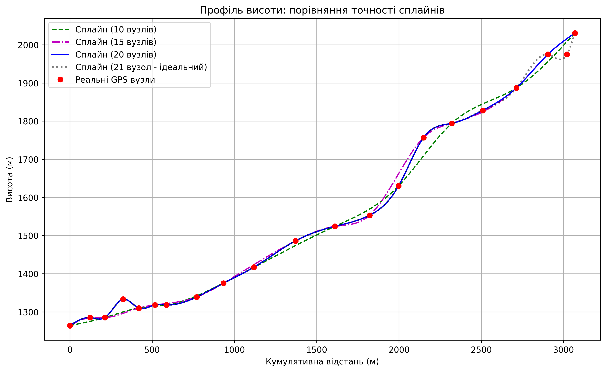
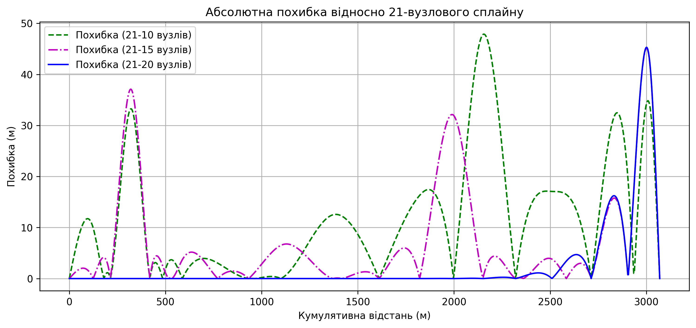

# Звіт
## Про виконання лабораторної роботи №1
### «Застосування чисельних методів інтерполяції кубічними сплайнами для аналізу профілю висоти маршруту»

**Міністерство освіти і науки України**  
**Львівський національний університет імені Івана Франка**  
**Факультет електроніки та комп’ютерних технологій**  
**Кафедра системного програмування**  

**Виконав:** Студент групи ФЕІ-12, Шутяк В. В.  
**Перевірив:** ас. Патинко А.М.  
**Місто:** Львів 2026  

---

### Мета:
Застосувати чисельні методи для обробки реальних геоданих GPS-координат маршруту, навчитися будувати гладкий профіль висоти від станції Заросляк до вершини гори Говерла за допомогою інтерполяції кубічними сплайнами та проаналізувати його складність на основі отриманої моделі.

### Хід роботи:

1. **Отримання геоданих:** Написано програму мовою програмування Python, яка здійснює HTTP-запит до відкритого API висот (Open-Elevation API) для отримання значень широти (latitude), довготи (longitude) та висоти (elevation) заданих пікетів маршруту.
2. **Обробка даних:** Обчислено кумулятивну відстань між вузлами (у метрах) за допомогою формули гаверсинуса (Haversine formula), що враховує кривизну поверхні Землі.
3. **Табуляція:** Результати у вигляді табличних даних виведені у консоль для перевірки (координати, висота та відстань накопичення).
4. **Математичне моделювання (Кубічний сплайн):** 
   * Реалізовано функцію для знаходження кубічних сплайнів для заданої сукупності вузлів. 
   * Побудовано СЛАР з тридіагональною матрицею та знайдено її коефіцієнти ($\alpha, \beta, \gamma, \delta, A, B$).
   * Програмою виконано пряму та зворотну прогонку для розв'язання даної СЛАР.
   * Унаслідок алгоритму знайдено коефіцієнти сплайну ($a, b, c, d$) для всіх інтервалів, що дозволило побудувати повністю гладку неперервну криву.
5. **Аналіз точності (Експериментальна частина):** Оцінено побудову кубічних сплайнів на різній кількості вхідних вузлів: 10, 15 та 20. Усі 3 моделі були накладені на оригінальні дані маршруту для аналізу.
6. **Розрахунок додаткових характеристик маршруту:**
   * Підраховано сумарний набір висоти та спуск;
   * Проаналізовано градієнт підйому: знайдено пікові нахили (розраховано першу похідну), а також середній градієнт;
   * Знайдено механічну енергію, яка затрачається людиною вагою 80 кг для проходження маршруту (у Джоулях та ккал).
7. **Результат візуалізації:**
   Сформовані графіки були автоматично збережені за допомогою бібліотеки `matplotlib` у файли `goverla_profile.png` та `goverla_errors.png`.

  
*Рис. 1. Графік профілю висоти маршруту (порівняння сплайнів з різною кількістю вузлів).*

  
*Рис. 2. Графік абсолютної похибки інтерполяції відносно еталонного 21-вузлового сплайну.*

### Аналіз впливу кількості вузлів на точність:
На основі проведеного аналізу побудованих графіків (Рис. 1 та Рис. 2) можна зробити наступні **власні спостереження**:
* **10 вузлів (зелений пунктир):** Модель досить груба і згладжує багато важливих перепадів висоти маршруту. Максимальна похибка сягає майже 50 метрів на окремих ділянках, що є неприпустимим для точного моделювання.
* **15 вузлів (пурпурна лінія):** Значно краще наближення, яке повторює більшість вигинів оригінального маршруту. Втім, на ділянках із різкими змінами рельєфу похибка все ще становить до 10-15 метрів.
* **20 вузлів (синя лінія):** Сплайн майже ідеальним чином описує реальні дані. Похибка стає мінімальною (зазвичай менше 1-2 метрів, окрім фінального підйому), що забезпечує високоточний та фізично реалістичний профіль висоти підйому.
* **Порівняльний аналіз:** Графік похибок наочно демонструє, що зі збільшенням кількості вузлів інтерполяція стає стабільнішою, а локальні відхилення зменшуються експоненціально.

### Висновок: 
Виконуючи цю лабораторну роботу, я навчився застосовувати чисельні методи на практиці для обробки реальних географічних даних. Було реалізовано алгоритм математичного згладжування за допомогою інтерполяції кубічними сплайнами та вивчено роботу методу прогонки для вирішення тридіагональної системи рівнянь у середовищі Python. Також було досліджено наочний вплив густоти сітки (кількості вузлів) на якість та точність апроксимації рельєфу Говерли. Отримані навички дають змогу розв'язувати задачі математичного моделювання даних з високою точністю для реальних інженерних або геоінформаційних задач.
