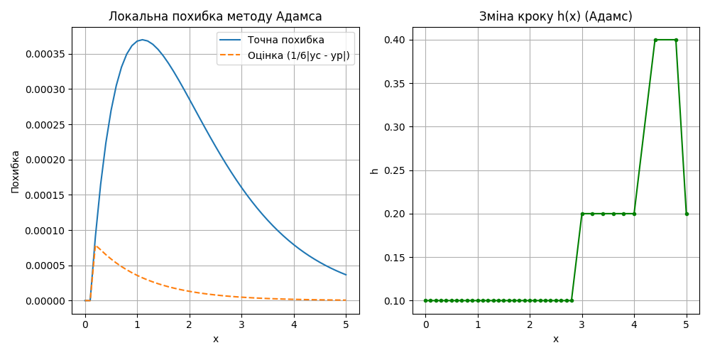
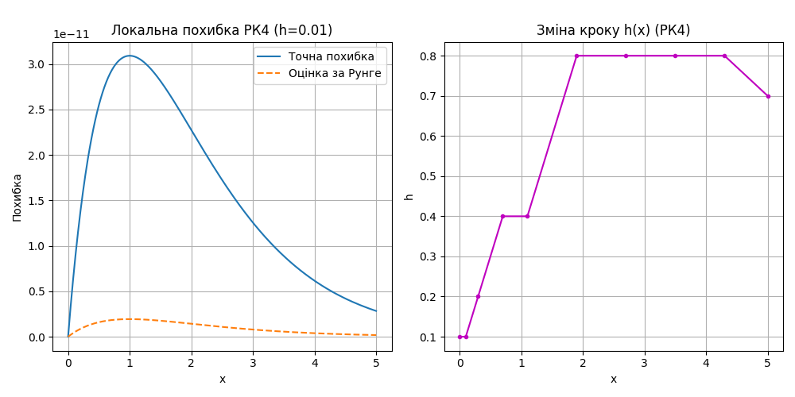

# Звіт
## Про виконання лабораторної роботи №10
### «Методи Рунге-Кутта та Адамса розв’язання задачі Коші для звичайних диференціальних рівнянь першого порядку»

**Міністерство освіти і науки України**  
**Львівський національний університет імені Івана Франка**  
**Факультет електроніки та комп’ютерних технологій**  
**Кафедра системного програмування**  

**Виконав:** Студент групи ФЕІ-12, Шутяк В.В.  
**Перевірив:** ас. Патинко А.М.  
**Місто:** Львів 2026  

---

### Мета:
Вивчити метод Рунге-Кутта четвертого порядку та багатокроковий метод прогнозу і корекції Адамса для чисельного розв’язку задачі Коші. Освоїти алгоритми оцінки локальної похибки та розробити підхід для автоматичного адаптивного вибору кроку інтегрування.

### Хід роботи:

1. **Аналітичний розв'язок задачі:** Задано звичайне диференціальне рівняння першого порядку $y' = -y + x + 1$ на проміжку $x \in [0, 5]$ з початковою умовою $y(0) = 1$. Знайдено точний аналітичний розв'язок $y_{exact} = e^{-x} + x$, який використовувався як еталон для обчислення справжньої локальної похибки.
2. **Метод прогнозу та корекції Адамса (Ч.1):** 
   * Розроблено програму для чисельного розв'язку диференціального рівняння багатокроковим методом Адамса 2-го порядку.
   * Розраховано та побудовано графік локальної похибки на основі точного розв'язку, а також графік емпіричної оцінки похибки як $\frac{1}{6}|y^{(corr)} - y^{(pred)}|$.
   * Реалізовано алгоритм автоматичного вибору кроку, який динамічно збільшує або зменшує $h$ вдвічі залежно від величини локальної похибки, підтримуючи задану точність $\varepsilon$. Побудовано графік залежності кроку від $x$.
3. **Метод Рунге-Кутта 4-го порядку (Ч.2):** 
   * Створено програму, що розв'язує задачу Коші класичним однокроковим методом РК4 із заданим кроком.
   * Виконано обчислення локальної похибки за допомогою правила Рунге, яке ґрунтується на подвійному перерахунку вузла (з кроком $h$ та з подвійним зменшенням $h/2$). Формула оцінки похибки: $\delta \approx \frac{y^h - y^{h/2}}{15}$. Побудовано графік порівняння точної та оціненої похибок.
   * Успішно застосовано метод адаптивного вибору кроку $h(x)$ для алгоритму РК4 та побудовано графік зміни цього кроку вздовж осі інтегрування.

### Результати візуалізації:

#### Частина 1. Метод Адамса
  
*Рис. 1. Локальна похибка розв'язку методу прогнозу-корекції Адамса (зліва) та графік динамічної зміни розміру кроку $h$ при автоматичній адаптації для підтримання точності (справа).*

#### Частина 2. Метод Рунге-Кутта 4-го порядку
  
*Рис. 2. Оцінка локальної похибки методу Рунге-Кутта 4-го порядку в порівнянні з точним значенням (зліва) та адаптивна зміна розміру кроку алгоритмом (справа).*

### Висновок: 
У цій лабораторній роботі я поглибив свої знання про чисельні методи інтегрування диференціальних рівнянь, безпосередньо порівнявши явний однокроковий метод (Рунге-Кутта 4-го порядку) з багатокроковим методом (прогноз та корекція Адамса). Практично підтверджено ефективність правила Рунге для оцінки локальної похибки без знання точного аналітичного розв'язку. До того ж, запровадження адаптивної зміни кроку довело свою доцільність — алгоритми успішно зменшували крок на ділянках із швидкою зміною функції і збільшували його там, де крива ставала більш пологою, оптимізуючи таким чином обчислювальне навантаження.
