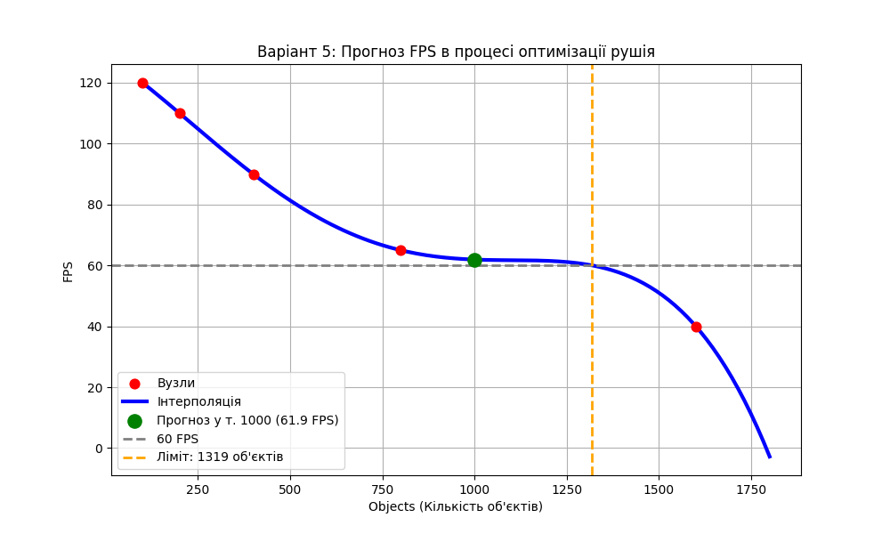
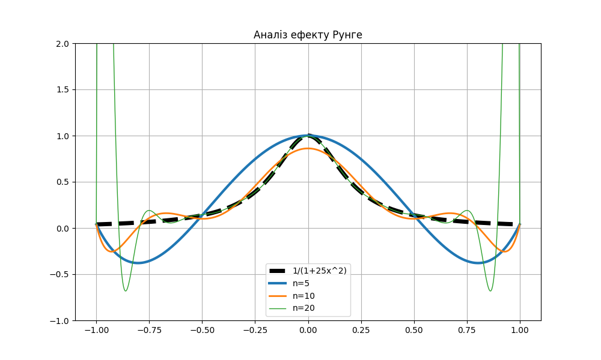

# Звіт
## Про виконання лабораторної роботи №2
### «Розділені різниці. Інтерполяційні многочлени Ньютона та факторіальних многочленів»

**Міністерство освіти і науки України**  
**Львівський національний університет імені Івана Франка**  
**Факультет електроніки та комп’ютерних технологій**  
**Кафедра системного програмування**  

**Виконав:** Студент групи ФЕП-12, Шутяк В.В.  
**Перевірив:** ас. Патинко А.М.  
**Місто:** Львів 2026  

---

### Мета:
Вивчити методи обчислення розділених різниць довільного порядку та практично застосувати метод математичної інтерполяції за допомогою многочленів Ньютона та факторіальних многочленів для різних конфігурацій вузлів. Проаналізувати продуктивність ігрового рушія в залежності від кількості відображених об'єктів (Варіант 5) та дослідити коливання полінома на прикладі функції Рунге.

### Хід роботи:

1. **Генерація та отримання даних:** Написано програму мовою Python, яка генерує дослідницькі дані для Варіанту 5 (залежність FPS від кількості об'єктів у сцені гри). Дані автоматично записуються та зчитуються з CSV-файлу `data_var5.csv` для подальшої обробки.
2. **Обробка та побудова таблиці розділених різниць:** Розроблено алгоритм для обчислення таблиці розділених різниць довільного порядку на основі отриманих вузлів. Дані результати необхідні для побудови многочлена Ньютона.
3. **Математичне моделювання (Многочлен Ньютона):**
   * Реалізовано функцію для обчислення інтерполяційного многочлена Ньютона у шуканій точці. Завдяки цій моделі було розраховано прогноз FPS (`61.9286 FPS`) для нестандартної оптимізаційної кількості об'єктів ($n = 1000$).
   * Значення моделі екстраполюються на ширший діапазон, що дозволяє досліджувати поводження продуктивності між вузлами.
4. **Факторіальні многочлени:** 
   * Реалізовано таблицю скінченних різниць та обчислення за допомогою факторіального полінома.
   * Оскільки аргументи (кількість об'єктів: 100, 200, 400, 800, 1600) утворюють геометричну прогресію, було застосовано логарифмічне відображення $i = \log_2(\text{Objects}/100)$ для переходу до рівновіддалених вузлів. Це дало змогу успішно розрахувати факторіальний многочлен.
5. **Оптимізація ігрового рушія:** Алгоритмічно перевірено створену модель для знаходження точки, де продуктивність починає падати нижче 60 кадрів/с. Згідно з результатами інтерполяції, межею стабільності 60+ FPS є $\sim 1319$ об'єктів сценіка.
6. **Розрахунок додаткових дослідницьких завдань:**
   * **(а) Вплив кроку та кількості вузлів:** Проаналізовано точність моделі для еталонної функції $f(x) = \sin(x)$ на різних інтервалах із різною кількістю вузлів ($n=5, 10, 20$). Математично зафіксовано різке зменшення похибки (до $9.20\times 10^{-14}$) при збільшенні вузлів.
   * **(б) Порівняння Ньютона і Лагранжа:** Написано метод обчислення многочлена Лагранжа та доведено їхню повну еквівалентність при ідентичних вузлах.

### Результат візуалізації (Варіант 5):
Сформовані графіки оптимізації та інтерполяції були автоматично збережені за допомогою бібліотеки `matplotlib` у файл `var5.png`.

  
*Рис. 1. Графік залежності FPS від кількості об'єктів у кадрі (інтерполяція Ньютона) та пошук межі у 60 FPS.*

---

### Аналіз ефекту Рунге (Дослідницька частина):
У ході лабораторної необхідно було окремо дослідити осцилюючий ефект Рунге на функції $f(x) = \frac{1}{1 + 25x^2}$ на інтервалі $[-1, 1]$.  Для цього в програмі була побудована інтерполяція Ньютона для фіксованої сукупності 5, 10 та 20 рівномірних вузлів. 

  
*Рис. 2. Демонстрація розбіжності Ньютонівської інтерполяції на краях проміжку (Ефект Рунге).*

На основі проведеного аналізу побудованих графіків на Рис. 2. можна зробити наступні **власні спостереження**:
* **$n=5$ вузлів (червона лінія):** Модель дуже плавно наближає дзвіноподібну форму функції, проте є досить грубою біля центру (пік $x=0$ зрізаний). Ніяких різких коливань немає.
* **$n=10$ вузлів (зелена лінія):** Центр купола описується значно точніше, оскільки вузли лежать ближче один до одного на перепаді функції. Але на краях проміжку (біля $x=-1$ та $x=1$) починають з'являтися сильні помітні відхилення полінома в мінусову полярність. 
* **$n=20$ вузлів (синя лінія):** Відбувається стрімке посилення ефекту Рунге. У центральній частині $(-0.5, 0.5)$ поліном зливається з оригінальною функцією майже ідеально. Але ближче до границь інтервалу похибка зростає катастрофічно через перенасиченість високостепеневого многочлена коливаннями.

### Висновок: 
Виконуючи цю лабораторну роботу, я навчився на практиці обчислювати таблицю розділених різниць та застосовувати многочлен Ньютона як універсальний інструмент інтерполяції будь-якої сукупності вузлів. Для рівномірних проміжків було досліджено апарат скінченних різниць за допомогою факторіальних многочленів. Застосовуючи цю теорію для оптимізації ігрового рушія, мені вдалося легко спрогнозувати продуктивність кадрів за відсутності експериментальних даних для конкретних точок навантаження. Зрештою, дослідження явища Рунге показало, чому просте підвищення кількості рівномірних точок для інтерполяції одного загального полінома не є панацеєю і часто призводить до фатальних помилок на краях моделювання.
