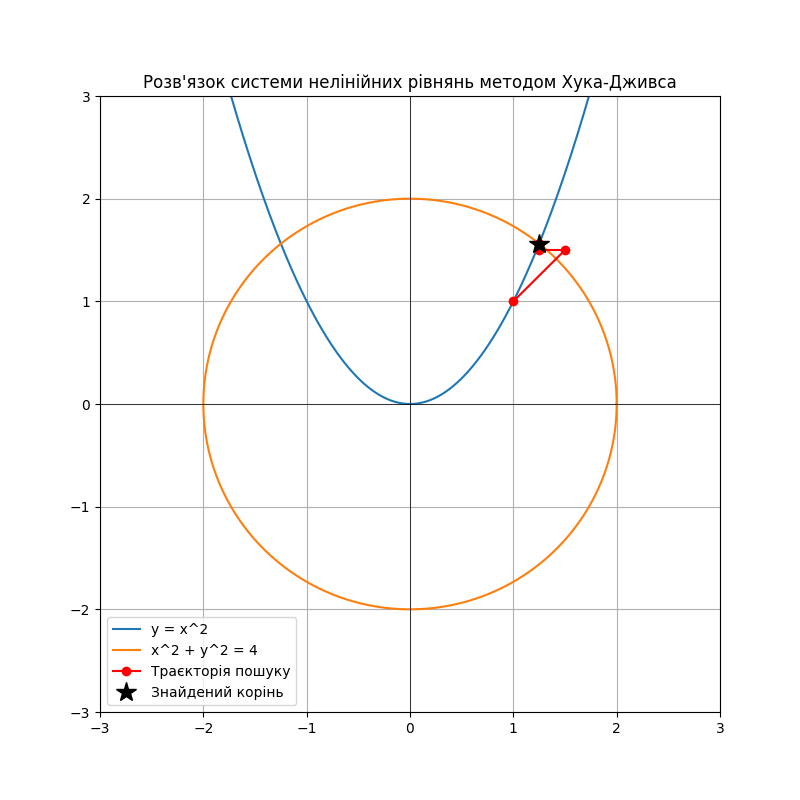

# Звіт
## Про виконання лабораторної роботи №9
### «Метод Хука-Дживса багатовимірної оптимізації»

**Міністерство освіти і науки України**  
**Львівський національний університет імені Івана Франка**  
**Факультет електроніки та комп’ютерних технологій**  
**Кафедра системного програмування**  

**Виконав:** Студент групи ФЕІ-12, Шутяк В.В.  
**Перевірив:** ас. Патинко А.М.  
**Місто:** Львів 2026  

---

### Мета:
Вивчити використання методу нульового порядку Хука-Дживса для розв’язку системи нелінійних рівнянь шляхом мінімізації спеціально побудованої цільової функції.

### Хід роботи:

1. **Побудова алгоритму Хука-Дживса:** Написано програму мовою Python, яка реалізує алгоритм багатовимірної безумовної оптимізації нульового порядку Хука-Дживса. Алгоритм складається з двох етапів: досліджуючого пошуку вздовж координатних осей та прискорювального пошуку за зразком уздовж вдалого напрямку.
2. **Тестування на функції Розенброка:** Для перевірки працездатності розробленого методу було знайдено мінімум класичної тестової функції Розенброка $f(x, y) = 100(y - x^2)^2 + (1 - x)^2$. Метод успішно зійшовся до точки $(1, 1)$ за 25 ітерацій.
3. **Розв'язок системи нелінійних рівнянь:** 
   * Задано систему двох нелінійних рівнянь: $x^2 + y^2 = 4$ та $y = x^2$.
   * Побудовано цільову функцію $F(x,y) = (x^2 + y^2 - 4)^2 + (y - x^2)^2$, мінімум якої ($F(x,y)=0$) співпадає з розв'язком системи.
   * Використовуючи початкове наближення $(1, 1)$ та початковий крок $h=(0.5, 0.5)$, метод успішно локалізував розв'язок системи. Координати точок траєкторії спуску було виведено та збережено у файл `path.txt`.
4. **Візуалізація:** За допомогою бібліотеки `matplotlib` побудовано графік кривих рівнянь (коло та парабола). Поверх цього графіка нанесено точки траєкторії оптимізації від початкової до знайденого кореня.

### Результат візуалізації:

  
*Рис. 1. Графік кривих заданої системи нелінійних рівнянь та візуалізація траєкторії пошуку кореня методом Хука-Дживса.*

### Висновок: 
У ході лабораторної роботи було детально розглянуто методи багатовимірної оптимізації нульового порядку. Програмно реалізовано алгоритм Хука-Дживса та показано його ефективність на прикладі складної "ярової" функції Розенброка. Застосувавши метод найменших квадратів для зведення задачі розв'язку системи нелінійних рівнянь до задачі оптимізації, я успішно знайшов точки перетину двох нелінійних кривих, візуально підтвердивши точність алгоритмічного пошуку та його збіжність до правильного розв'язку.
